<p align="center">
  
</p>

<p align="center">
  <a href="https://ubuntu.com/server"></a>&nbsp;
  <a href="https://k3s.io"></a>&nbsp;
  <a href="https://argo-cd.readthedocs.io"></a>&nbsp;
  <a href="https://tailscale.com"></a>&nbsp;
  <a href="https://www.ansible.com"></a>
</p>

<p align="center">
  &nbsp;
  &nbsp;
  &nbsp;
  
</p>

<br/>

<p align="center">
  <strong>Vollständig automatisierter, GitOps-getriebener Home-Server auf einer einzigen Maschine.</strong><br/>
  Ein einziger Ansible-Run liefert einen gehärteten Ubuntu-Host, einen schlanken Kubernetes-Cluster (<a href="https://k3s.io">k3s</a>), Continuous Delivery aus Git (<a href="https://argo-cd.readthedocs.io">ArgoCD</a>) und Zero-Config-Remote-Access (<a href="https://tailscale.com">Tailscale</a>).
</p>

<br/>

---

## ⚡ TL;DR

```bash
# 1) Repo klonen
git clone https://github.com/pkr-lab/capulus-core.git && cd capulus-core

# 2) Eigene Details eintragen (Server-IP, Repo-URL, Tailscale-Key)
$EDITOR ansible/inventory/hosts.yml
$EDITOR ansible/group_vars/all.yml

# 3) Collections installieren und Playbook laufen lassen
make install
# oder:
# ansible-galaxy collection install -r ansible/requirements.yml
# ansible-playbook -i ansible/inventory/hosts.yml ansible/site.yml --ask-vault-pass
```

> Am Ende druckt das Playbook die ArgoCD-URL und das Admin-Passwort. **Fertig.**

---

## Was du bekommst

<table>
<thead>
<tr>
<th>Schicht</th>
<th>Komponente</th>
<th>Hinweis</th>
</tr>
</thead>
<tbody>
<tr><td>Betriebssystem</td><td><strong>Ubuntu Server 26.04 LTS</strong></td><td>Gehärtet, UFW-Firewall, NTP-synced, Swap off</td></tr>
<tr><td>Kubernetes</td><td><strong>k3s</strong> (latest stable)</td><td>Single-Node, Traefik, CoreDNS, local-path, metrics-server</td></tr>
<tr><td>GitOps</td><td><strong>ArgoCD</strong> + ApplicationSets</td><td>Verzeichnis unter <code>argocd/apps/</code> anlegen → pushen → deployed</td></tr>
<tr><td>Split-DNS</td><td><strong>dnsmasq</strong> auf <code>tailscale0</code></td><td><code>*.homeserver</code> aus LAN und Tailnet auflösbar</td></tr>
<tr><td>Web-Ansible</td><td><strong>Semaphore UI</strong></td><td>Ein-Klick-<code>git pull &amp;&amp; ansible-playbook</code> gegen das eigene LAN</td></tr>
<tr><td>Monitoring</td><td><strong>VictoriaMetrics + Grafana</strong></td><td>Single-Node TSDB, vmagent, vmalert, Alertmanager, Dashboards</td></tr>
<tr><td>Kubernetes-UI</td><td><strong>Headlamp</strong></td><td>Browser-Dashboard für den Cluster</td></tr>
<tr><td>Secrets</td><td><strong>Sealed Secrets + kubeseal-webgui</strong></td><td>Verschlüsselte Secrets in Git, nur im Cluster entschlüsselbar</td></tr>
<tr><td>Notifications</td><td><strong>Gotify</strong> + <strong>ntfy</strong></td><td>Self-hosted Push — Gotify (Android), ntfy (iOS + Android)</td></tr>
<tr><td>Remote-Access</td><td><strong>Tailscale</strong></td><td>WireGuard-Mesh-VPN — keine Portfreigaben, keine öffentliche IP</td></tr>
<tr><td>CI/CD intern</td><td><strong>Argo Workflows + MinIO</strong></td><td>Private CI/CD-Pipeline + S3-Artifact-Store im Cluster</td></tr>
<tr><td>Ingress</td><td><strong>Traefik v2</strong> (k3s bundled)</td><td>HTTP/HTTPS-Routing in den Cluster</td></tr>
<tr><td>SSO</td><td><strong>Authentik</strong></td><td>Zentraler Identity Provider für alle Dienste via OIDC</td></tr>
<tr><td>Provisioning</td><td><strong>Ansible</strong> (≥ 2.14)</td><td>Vollständig idempotent, Role-per-Concern, Vault für Secrets</td></tr>
</tbody>
</table>

> **Ziel-Hardware:** kleine Box mit ≥ 4 GB RAM und ≥ 20 GB Disk.
> **Referenz-Build:** Intel i5, 32 GB RAM, 512 GB NVMe.

<details>
<summary><strong>Auto-Upgrade-Details</strong></summary>

`auto_upgrade: true` (Default) hält bei jedem Playbook-Run den gesamten Stack aktuell:

| Komponente | Mechanismus |
|---|---|
| **APT-Pakete** | `apt dist-upgrade` + `unattended-upgrades` für tägliche Sicherheits-Patches |
| **Tailscale** | `state: latest` für das `tailscale`-Paket |
| **k3s** | Folgt `k3s_channel` (Default `stable`), pin via `k3s_version` |
| **Helm** | Re-Run des offiziellen Installers bei neuem Release |
| **ArgoCD** | `helm upgrade --install` ohne `--version`, pin via `argocd_version` |
| **Reboot** | Auto-Reboot wenn APT `/var/run/reboot-required` setzt (togglebar via `auto_reboot_if_required`) |

Für reproduzierbare Builds: `auto_upgrade: false` in `ansible/group_vars/all.yml`.

</details>

---

## Quickstart (5 Schritte)

> Erstmalig auf der Maschine? Start mit **[Ubuntu-Server-Installation](docs/00-ubuntu-server-install.md)**.
> Komplette Voraussetzungen: **[docs/02-prerequisites.md](docs/02-prerequisites.md)**.

<details open>
<summary><strong>Schritt-für-Schritt aufklappen</strong></summary>

**1. Repo klonen**

```bash
git clone https://github.com/pkr-lab/capulus-core.git
cd capulus-core
```

**2. Inventory auf den eigenen Server zeigen**

```bash
$EDITOR ansible/inventory/hosts.yml
# ansible_host (Server-IP) und ggf. ansible_ssh_private_key_file anpassen.
```

**3. Variablen setzen**

```bash
$EDITOR ansible/group_vars/all.yml
# Pflicht: argocd_repo_url, local_subnet, timezone.
# Tailscale-Key muss vault-encrypted sein (nächster Schritt).
```

**4. Tailscale-Auth-Key verschlüsseln**

```bash
ansible-vault encrypt_string 'tskey-auth-DEIN_KEY' --name 'tailscale_auth_key'
# Den !vault-Block in all.yml über den bestehenden tailscale_auth_key-Wert pasten.
```

**5. Playbook ausführen**

```bash
make install
# oder ohne make:
ansible-galaxy collection install -r ansible/requirements.yml
ansible-playbook -i ansible/inventory/hosts.yml ansible/site.yml --ask-vault-pass
```

**Ergebnis:**

```
ArgoCD UI:  http://<server-ip>:30080
Username:   admin
Password:   <auto-generiert>
```

</details>

---

## Repository-Layout

<details>
<summary><strong>Verzeichnisstruktur anzeigen</strong></summary>

```
capulus-core/
├── README.md
├── Makefile                          # Convenience-Targets: install, lint, ping, check, …
├── docs/
│   ├── 00-ubuntu-server-install.md   # Bare-Metal-Ubuntu-Installation
│   ├── 01-overview.md                # Architektur-Diagramme
│   ├── 02-prerequisites.md           # Voraussetzungen & Pre-flight
│   ├── 03-installation.md            # Step-by-Step-Setup
│   ├── 04-k3s.md                     # k3s + kubectl-Referenz
│   ├── 05-argocd.md                  # GitOps-Nutzung
│   ├── 06-tailscale.md               # VPN-Setup
│   ├── 07-troubleshooting.md         # Häufige Probleme
│   ├── 08-semaphore.md               # Semaphore-Web-UI für Ansible
│   ├── 09-dns-architecture.md        # Split-DNS-Design & Ausfallsicherheit
│   ├── 11-gotify.md                  # Push-Notifications via Gotify
│   ├── 13-argo-workflows.md          # Private CI/CD mit Argo Workflows + MinIO
│   ├── 14-sso-authentik.md           # Single-Sign-On via Authentik
│   ├── 15-ntfy.md                    # iOS Push-Notifications via ntfy
│   ├── 15-cert-login.md              # Zertifikats-Authentifizierung via Traefik mTLS
│   ├── 16-sso-alle-dienste.md        # SSO-Konfiguration für alle Dienste
│   └── assets/banner.svg
├── ansible/
│   ├── site.yml                      # Entry-Point
│   ├── requirements.yml              # Galaxy-Collections
│   ├── ansible.cfg                   # Defaults
│   ├── inventory/hosts.yml           # Eigener Server (+ semaphore_targets)
│   ├── group_vars/all.yml            # Alle Knobs (vault-verschlüsselte Secrets)
│   └── roles/
│       ├── common/                   # Base-OS, Firewall, Pakete
│       ├── dnsmasq/                  # Split-DNS für *.homeserver
│       ├── tailscale/                # VPN (WireGuard-Mesh)
│       ├── k3s/                      # Kubernetes Control-Plane + Helm
│       ├── k3s_agent/                # Kubernetes Worker-Node
│       ├── argocd/                   # GitOps-Controller via Helm
│       ├── semaphore_secrets/        # Bootstrap-Secret für den Semaphore-Pod
│       ├── semaphore_targets/        # SSH-Pubkey auf Managed-Hosts pushen
│       └── semaphore_bootstrap/      # Projects/Inventories/Templates per API
└── argocd/
    ├── bootstrap/root-applicationset.yaml  # Erkennt jedes Verzeichnis darunter
    └── apps/                               # Ein Ordner pro ArgoCD-Application
        ├── example-whoami/
        ├── gotify/                   # Push-Notifications (Android)
        ├── gotify-bridge/            # Alertmanager → Gotify Webhook-Bridge
        ├── ntfy/                     # Push-Notifications (iOS + Android)
        ├── ntfy-bridge/              # Alertmanager → ntfy Webhook-Bridge
        ├── headlamp/                 # Kubernetes-Web-Dashboard
        ├── kubeseal-webgui/          # Sealed-Secrets-Verschlüsselungs-UI
        ├── monitoring/               # VictoriaMetrics + Grafana
        ├── argo-workflows/           # Private CI/CD-Pipeline
        ├── minio/                    # S3-Artifact-Store für Argo Workflows
        ├── coredns-custom/           # Zusätzliche CoreDNS-Zonen
        ├── sealed-secrets/           # SealedSecrets-Controller
        ├── authentik/                # Authentik Single-Sign-On
        └── semaphore/                # Ansible-Web-UI
```

</details>

---

## Monitoring

Ein schlanker VictoriaMetrics-+-Grafana-Stack lebt unter `argocd/apps/monitoring/` und wird automatisch von ArgoCD ausgerollt.

<details>
<summary><strong>Stack-Details</strong></summary>

| Komponente | Detail |
|---|---|
| **TSDB** | VMSingle — 15 Tage Retention, 10 Gi `local-path`-PVC |
| **Scrapers** | VMAgent scrapet alle `VMServiceScrape`/`VMPodScrape` + Prometheus `ServiceMonitor`-CRDs |
| **Host-Metriken** | `prometheus-node-exporter` als DaemonSet auf dem Ubuntu-Host |
| **Cluster-Metriken** | kubelet/cAdvisor, kube-apiserver, kube-state-metrics, CoreDNS |
| **Alerts** | Default-kube-prometheus-Rules; Gotify- und ntfy-Alertmanager-Bridges |
| **Dashboards** | Node Exporter Full, VictoriaMetrics + Kubernetes Views von grafana.com |

</details>

Grafana öffnen unter **http://grafana.homeserver** — Admin-Passwort abfragen:

```bash
kubectl -n monitoring get secret monitoring-grafana \
  -o jsonpath='{.data.admin-password}' | base64 -d; echo
```

---

## Application hinzufügen (GitOps-Weg)

```bash
mkdir -p argocd/apps/my-app
# Plain Kubernetes-YAML, kustomization.yaml oder ein Helm-Chart hineinlegen.
git add argocd/apps/my-app && git commit -m "feat(apps): add my-app" && git push
```

> Innerhalb von ~3 Minuten erkennt ArgoCD das neue Verzeichnis, erstellt eine `Application` namens `my-app` im Namespace `my-app` und synct sie.
> Details: **[docs/05-argocd.md](docs/05-argocd.md)**

---

## Service-URLs

| Service | URL |
|---|---|
| Grafana | http://grafana.homeserver |
| ArgoCD | http://\<server-ip\>:30080 |
| Headlamp | http://headlamp.homeserver |
| Semaphore | http://semaphore.homeserver |
| Authentik | http://authentik.homeserver |
| Gotify | http://gotify.homeserver |
| ntfy | http://ntfy.homeserver |
| Argo Workflows | http://argo-workflows.homeserver |
| MinIO Console | http://minio.homeserver |
| kubeseal-webgui | http://kubeseal-webgui.homeserver |

---

## Networking & Security

<table>
<thead><tr><th>Prinzip</th><th>Umsetzung</th></tr></thead>
<tbody>
<tr><td>Keine öffentlichen Ports</td><td>Zugriff ausschließlich über LAN oder Tailscale-VPN</td></tr>
<tr><td>UFW-Firewall</td><td>Erlaubt nur SSH, HTTP/HTTPS, k3s-API, ArgoCD-NodePort, Flannel, Tailscale-UDP</td></tr>
<tr><td>Ansible-Vault</td><td>Sensitive Secrets verschlüsselt at rest</td></tr>
<tr><td>ArgoCD Read-only</td><td>Hat ausschließlich Read-Access auf das Git-Repo</td></tr>
</tbody>
</table>

<details>
<summary><strong>Firewall-Ports</strong></summary>

| Port | Protokoll | Scope | Zweck |
|---|---|---|---|
| 22 | TCP | LAN + Tailnet | SSH |
| 53 | UDP+TCP | LAN + Tailnet | dnsmasq Split-DNS für `*.homeserver` |
| 80 | TCP | LAN + Tailnet | Traefik HTTP |
| 443 | TCP | LAN + Tailnet | Traefik HTTPS |
| 6443 | TCP | LAN + Tailnet | k3s-API |
| 30080 | TCP | LAN + Tailnet | ArgoCD-UI (HTTP) |
| 30443 | TCP | LAN + Tailnet | ArgoCD-UI (HTTPS) |
| 41641 | UDP | Internet | Tailscale-WireGuard |

</details>

Vollständige Architektur: **[docs/01-overview.md](docs/01-overview.md)**

---

## Dokumentation

| Dokument | Inhalt |
|---|---|
| [Ubuntu-Server-Installation](docs/00-ubuntu-server-install.md) | ISO, USB-Stick, Installer, erster Boot |
| [Architektur-Überblick](docs/01-overview.md) | Komponenten und Traffic-Flows |
| [Voraussetzungen](docs/02-prerequisites.md) | Was vor dem Ansible-Run nötig ist |
| [Installationsleitfaden](docs/03-installation.md) | Vollständiger Step-by-Step-Walkthrough |
| [k3s-Referenz](docs/04-k3s.md) | Config, kubectl-Cheatsheet, Upgrades |
| [ArgoCD-GitOps](docs/05-argocd.md) | App-Workflow, CLI, Sync-Policies |
| [Tailscale-VPN](docs/06-tailscale.md) | Auth-Keys, MagicDNS, Subnet-Routes |
| [Troubleshooting](docs/07-troubleshooting.md) | Diagnose-Playbook für häufige Probleme |
| [Semaphore-UI](docs/08-semaphore.md) | Web-UI zum Ausführen von Playbooks |
| [DNS-Architektur](docs/09-dns-architecture.md) | Warum der Home-Server NICHT dein LAN-DNS ist |
| [Gotify-Push](docs/11-gotify.md) | Self-hosted Push-Notifications aus dem Stack |
| [Argo Workflows](docs/13-argo-workflows.md) | Private CI/CD-Pipeline mit MinIO-Artifact-Store |
| [SSO via Authentik](docs/14-sso-authentik.md) | Authentik als zentraler Identity Provider |
| [ntfy iOS-Push](docs/15-ntfy.md) | Self-hosted ntfy mit iOS APNs-Relay |
| [Zertifikats-Auth](docs/15-cert-login.md) | Traefik mTLS Client-Zertifikate |
| [SSO alle Dienste](docs/16-sso-alle-dienste.md) | Headlamp, Argo Workflows, MinIO via OIDC |
| [Wiki.js](docs/20-wikijs.md) | Wiki mit Gruppen/Page-Rules-Berechtigungen + Authentik-SSO |

---

<p align="center">
  MIT — siehe <a href="LICENSE">LICENSE</a>
  &nbsp;·&nbsp;
  Made with ☕ &amp; GitOps
</p>
